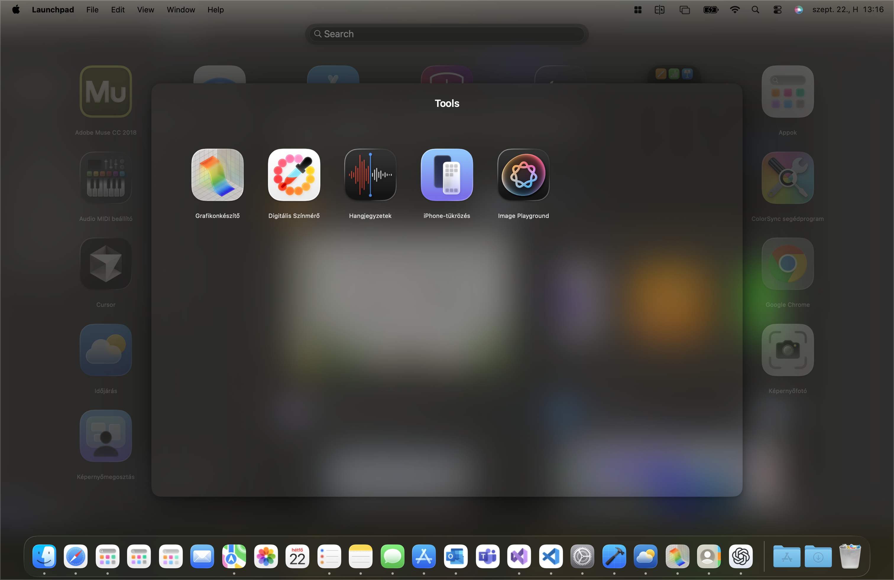
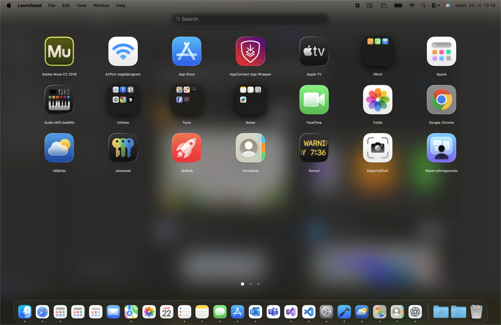

# 🚀 LaunchPad

A beautiful, modern macOS application launcher with glass morphism design, inspired by macOS Launchpad but with enhanced functionality and customization options. As you might know, Apple removed Launchpad in macOS 26. This app offers a true replacement with even more features.

If you like this project, and would like to have additional features, please support me:

## ✨ Features

### 🎨 **Beautiful Design**
- **Glass Morphism UI** - Modern translucent interface with backdrop blur
- **Smooth Animations** - Fluid transitions and spring animations throughout
- **Adaptive Layout** - Responsive design that adapts to different screen sizes
- **Visual Feedback** - Hover states, scaling effects, and interactive elements

### 🔍 **Smart Search**
- **Real-time Search** - Instant filtering as you type
- **Fuzzy Matching** - Find apps even with partial names
- **Vertical Scrolling** - Smooth scrolling through search results
- **No Results State** - Clean empty state with helpful messaging

### **Folder Management & Drag & Drop**
- **Create Folders** - Drag one app onto another to create a folder
- **Rename Folders** - Click folder name to edit and persist changes
- **Add/Remove Apps** - Drag apps into/out of folders, or use context menu to remove
- **Rearrangeable Icons** - Drag and drop to customize app order
- **Visual Feedback** - Apps scale and fade during drag operations
- **Persistent Order** - Your custom arrangement and folders are automatically saved
- **Smart Positioning** - Smooth animations when dropping apps

### 🎮 **Multiple Navigation Methods**

#### ⌨️ **Keyboard Navigation**
- `←/→` Arrow keys - Navigate between pages
- `CMD + ,` - Open settings
- `ESC` - Close application

#### 🖱️ **Mouse Navigation**
- **Click Navigation** - Click page dots to jump to any page
- **Scroll Wheel** - Horizontal scrolling for page navigation
- **Smart Scrolling** - Vertical scrolling in search mode
- **Click inside folder detail** - Does not close Launchpad

#### 📱 **Touch & Gestures**
- **Tap to Launch** - Single tap to open applications
- **Drag to Rearrange** - Long press and drag to reorder
- **Swipe Navigation** - Gesture-based page switching

## ⚙️ **Customizable Settings**

LaunchPad offers comprehensive customization options to tailor your experience:

### 🔧 **Accessing Settings**
- **Menu Bar**: `LaunchPad` → `Settings` (⌘,)

### 📐 **Grid Layout Configuration**
- **Columns**: Adjust from 4 to 12 columns per page
- **Rows**: Configure from 3 to 10 rows per page  
- **Apps per Page**: Automatically calculated (columns × rows)
- **Real-time Preview**: See changes instantly in the grid

### 🎨 **Icon Customization**
- **Icon Size**: Fine-tune icon size from 30% to 100%
- **Smooth Scaling**: Precise control with range slider
- **Visual Feedback**: Real-time percentage display
- **Optimal Sizing**: Default 60% provides perfect balance

## 🚀 Getting Started

### First Launch
1. The app will automatically scan `/Applications` and `/System/Applications`
2. Apps are initially sorted alphabetically
3. Use drag & drop to customize your layout and create folders
4. Click folder names to rename and persist changes
5. Your arrangement and folders are automatically saved
6. Launchpad will quit if you activate another app from the dock

### Usage
- **Search**: Type to filter apps instantly
- **Navigate Pages**: Use arrow keys, click dots, or scroll
- **Launch Apps**: Click any app icon to open
- **Rearrange**: Drag apps to new positions
- **Create Folders**: Drag one app onto another
- **Rename Folders**: Click folder name
- **Remove from Folder**: Use context menu or drag out
- **Quit Launchpad**: Activate another app or press ESC

## 🙏 Acknowledgments
- Based on LaunchBack project
- Inspired by macOS Launchpad
- Glass morphism design trends
- SwiftUI community examples
- macOS design guidelines
