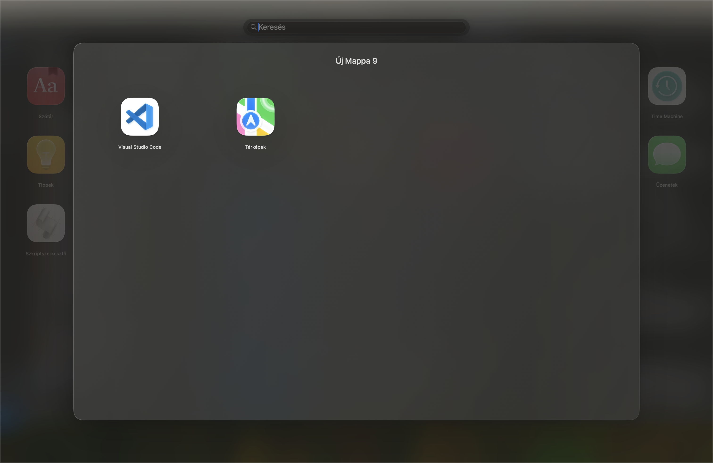
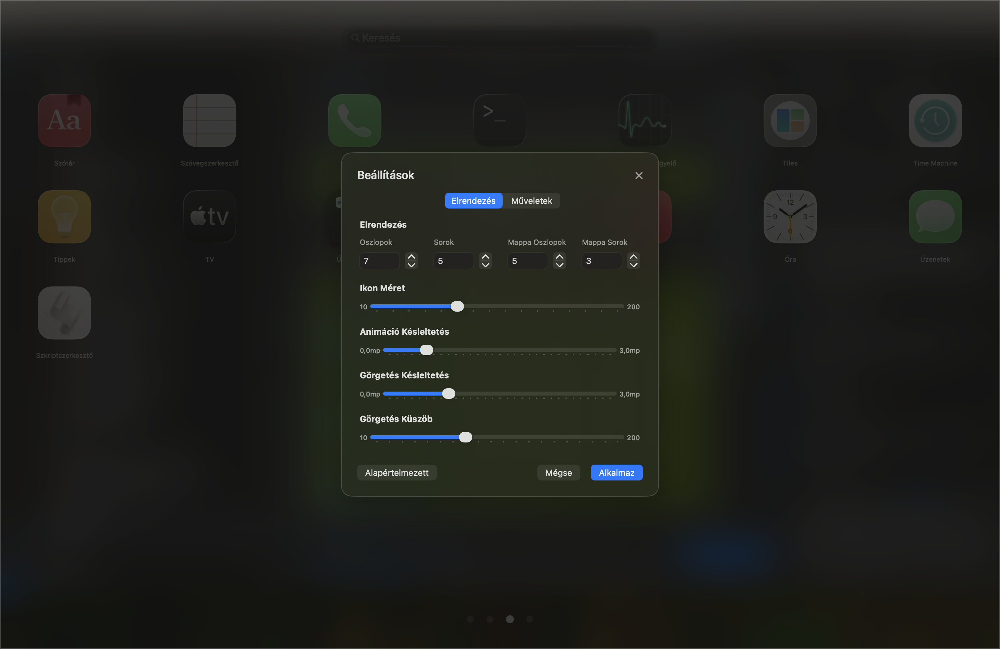
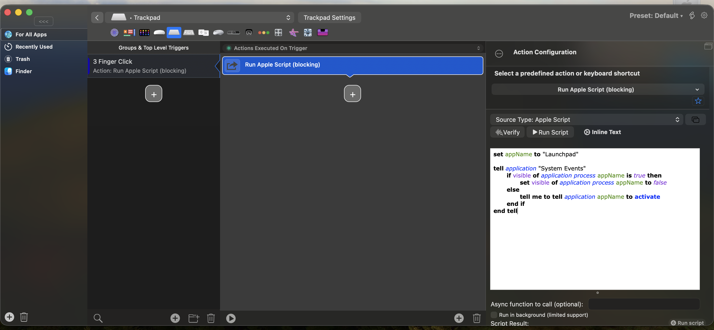

# 🚀 LaunchPad

A beautiful, modern macOS application launcher with glass morphism design, inspired by macOS Launchpad but with enhanced functionality and customization options. As you might know, Apple removed Launchpad in macOS 26. This app offers a true replacement with even more features and a fully customizable, persistent grid.

If you like this project and want to support further development, please consider:

<a href="https://www.buymeacoffee.com/Waikiki.com" target="_blank"></a>

## ✨ Features

### 🎨 **Modern, Adaptive Design**
- **Glass Morphism UI** – Translucent, blurred backgrounds for a modern look
- **Smooth Animations** – Fluid transitions and spring effects throughout
- **Justified Grid** – Icons and folders are always evenly distributed, filling all available space
- **Consistent Alignment** – Search results and grid pages always align perfectly
- **Responsive Layout** – Adapts to any screen size or aspect ratio


### 🔍 **Powerful Search**
- **Instant Filtering** – Real-time, fuzzy search as you type
- **Vertical Scrolling** – Effortless navigation through results
- **Consistent Alignment** – Search and grid always start at the same position
- **No Results State** – Clean, helpful empty state


### 🗂️ **Folders & Drag & Drop**
- **Create Folders** – Drag one app onto another to instantly create a folder
- **Rename Folders** – Click folder name to edit (auto-focus for new folders)
- **Add/Remove Apps** – Drag apps in/out of folders, or use context menu
- **Rearrangeable Icons** – Drag and drop to customize app order
- **Visual Feedback** – Apps scale and fade during drag operations
- **Persistent Layout** – All changes are saved automatically
- **Smart Overflow** – Apps overflow to new pages as needed


### New folder styles to match Liquid Glass



### New settings options



### 🎮 **Multiple Navigation Methods**

#### ⌨️ **Keyboard Navigation**
- `←/→` Arrow keys – Navigate between pages
- `CMD + ,` – Open settings
- `ESC` – Close application

#### 🖱️ **Mouse Navigation**
- **Click Navigation** – Click page dots to jump to any page
- **Scroll Wheel** – Horizontal scrolling for page navigation
- **Smart Scrolling** – Vertical scrolling in search mode
- **Click inside folder detail** – Does not close Launchpad

#### 📱 **Touch & Gestures**
- **Tap to Launch** – Single tap to open applications
- **Drag to Rearrange** – Long press and drag to reorder
- **Swipe Navigation** – Gesture-based page switching

## ⚙️ **Comprehensive Settings**

LaunchPad offers deep customization to tailor your experience:


### 🔧 **Accessing Settings**
- **Menu Bar**: `LaunchPad` → `Settings` (⌘,)

### 📐 **Grid & Layout Configuration**
- **Columns**: 2–20 per page with stepper controls
- **Rows**: 2–15 per page with stepper controls  
- **Folder Grid**: Separate 2–8 columns, 1–6 rows configuration
- **Apps per Page**: Calculated automatically based on grid
- **Justified Grid**: Icons and folders always fill the grid evenly
- **Real-time Preview**: See changes instantly with live updates

### 🎨 **Icon & Animation Customization**
- **Icon Size**: Fine-tune from 50–200 px with 10px increments
- **Drop Animation Delay**: 0.0–3.0 seconds for drag & drop feedback
- **Scroll Sensitivity**: Configurable page navigation thresholds
- **Scroll Debounce**: 0.0–3.0 seconds for smooth navigation
- **Visual Feedback**: Real-time display and smooth scaling
- **Consistent Animations**: Unified spring animations throughout

### 🧩 **Layout Management & Backup**
- **Persistent Storage** – All settings and layouts automatically saved
- **Export/Import** – Backup your custom layouts as JSON files
- **Reset Options** – Return to alphabetical order with confirmation
- **Smart Validation** – Settings enforce reasonable bounds and limits  
- **Consistent Alignment** – Search and grid always start at the same position
- **Cross-Device Sync** – Export layouts to share between machines

## 🚀 Getting Started

### First Launch
1. The app scans `/Applications` and `/System/Applications`
2. Apps are sorted alphabetically
3. Use drag & drop to customize your layout and create folders
4. Click folder names to rename (auto-focus for new folders)
5. All changes are saved automatically
6. Launchpad quits if you activate another app from the dock

### Usage
- **Search**: Type to filter apps instantly
- **Navigate Pages**: Use arrow keys, click dots, or scroll
- **Launch Apps**: Click any app icon to open
- **Rearrange**: Drag apps to new positions
- **Create Folders**: Drag one app onto another
- **Rename Folders**: Click folder name (auto-focus for new folders)
- **Remove from Folder**: Use context menu or drag out
- **Quit Launchpad**: Activate another app or press ESC

## 🏗️ **Architecture & Performance**

### 🚀 **Optimized Codebase**
- **MVVM Architecture** – Clean separation with SwiftUI's reactive patterns
- **Centralized Constants** – Over 25 magic numbers consolidated for maintainability
- **Reusable Components** – Modular UI components reduce code duplication by 75%
- **Performance Optimized** – Minimal object creation and efficient memory management
- **Clean Code** – Debug statements removed, consistent naming, and optimized imports

### 🧪 **Comprehensive Testing**
- **Unit Test Coverage** – Extensive tests for core functionality
- **App Discovery Tests** – Validates application scanning and detection
- **Persistence Tests** – Ensures layout and settings are properly saved
- **Import/Export Tests** – Verifies layout backup and restore functionality

### 🌐 **Internationalization**
- **Multi-language Support** – English and Hungarian localizations
- **Centralized Strings** – Easy to add new languages
- **Cultural Adaptation** – Proper formatting for different locales

## �️ **Development & Technical Details**

### 📁 **Project Structure**
```
Launchpad/
├── LaunchpadApp.swift              # App entry point
├── Managers/
│   ├── AppManager.swift           # App discovery & layout management
│   └── SettingsManager.swift      # User preferences & configuration
├── Models/
│   ├── AppGridItem.swift          # Unified app/folder model
│   ├── LaunchpadSettings.swift    # Configuration with validation
│   └── LayoutMetrics.swift        # Responsive grid calculations
├── Components/
│   ├── PagedGridView.swift        # Main container with navigation
│   ├── Search/                    # Real-time search functionality
│   ├── Folders/                   # Folder management UI
│   ├── Settings/                  # Tabbed settings interface
│   └── DropZones/                 # Drag & drop navigation
├── Delegates/
│   └── *DropDelegate.swift        # Drag & drop handling
├── Utilities/
│   ├── LaunchPadConstants.swift   # Centralized constants
│   ├── LocalizationHelper.swift   # L10n system
│   └── AppGridItemExtensions.swift # Serialization helpers
└── Tests/                          # Comprehensive test suite
```

### ⚡ **Key Technical Features**
- **SwiftUI + MVVM**: Modern reactive architecture
- **Singleton Managers**: Centralized state management
- **JSON Serialization**: Layout import/export functionality
- **NSVisualEffectView**: Native glass morphism implementation
- **Drag & Drop Delegates**: Complex interaction handling
- **LazyVGrid**: Performance-optimized large collections
- **Persistent Storage**: UserDefaults with automatic saving

### 🚀 **Requirements**
- **macOS**: 15.6 or later
- **Xcode**: 15.0 or later
- **Swift**: 6.0
- **Architecture**: Universal (Apple Silicon + Intel)

### 🔧 **Build & Run**
1. Clone the repository
2. Open `Launchpad.xcodeproj` in Xcode
3. Build and run (⌘+R)
4. Grant necessary permissions when prompted

**Optimized**: The codebase has been thoroughly optimized with improved architecture, centralized constants, reusable components, and enhanced performance for a smoother development experience.

## 📜 AppleScript to Toggle LaunchPad

Configuration for Better touch tool:


Use this AppleScript to create a keyboard shortcut or automation to show/hide LaunchPad:

```applescript
set appName to "Launchpad"

tell application "System Events"
	if visible of application process appName is true then
		set visible of application process appName to false
	else
		tell me to tell application appName to activate
	end if
end tell
```

## 🙏 Acknowledgments
- Based on LaunchBack project
- Inspired by macOS Launchpad
- Glass morphism design trends
- SwiftUI community examples
- macOS design guidelines
