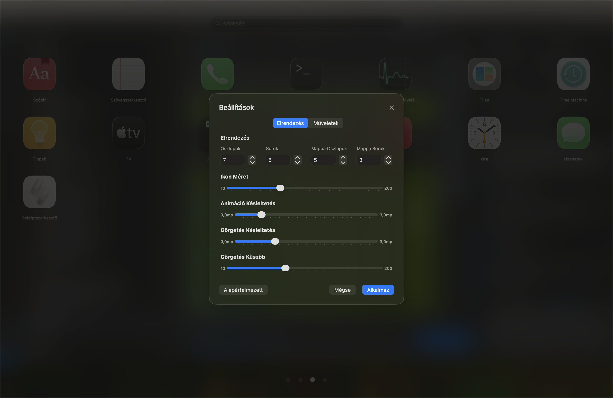
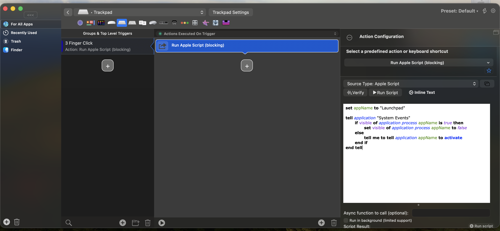

# 🚀 LaunchPad

A beautiful, modern macOS application launcher with glass morphism design, inspired by macOS Launchpad but with enhanced functionality and customization. As you might know, Apple removed Launchpad in macOS 26. This app offers a complete replacement with more features and a fully customizable, persistent grid.

If you like this project and want to support further development:

<a href="https://www.buymeacoffee.com/Waikiki.com" target="_blank"></a>

**[📥 Download Launchpad v2.1](https://github.com/kristof12345/Launchpad/releases/download/v2.1/Launchpad.app.zip)**

## ✨ Features

### 🎨 **Modern Design**
- Glass morphism UI with translucent, blurred backgrounds
- Smooth animations and fluid transitions throughout
- Justified grid layout – icons evenly distributed
- Responsive layout adapts to any screen size
- Consistent alignment across all views


### 🔍 **Smart Search**
- Real-time fuzzy search as you type
- Press Enter to launch the first result
- Vertical scrolling through results
- Search within folders automatically
- Clean empty state for no results


### 🗂️ **Folders & Organization**
- Drag one app onto another to create folders
- Click folder names to rename instantly
- Drag apps in/out of folders seamlessly
- Rearrange icons with drag & drop
- Visual feedback during interactions
- Auto-save all layout changes
- Smart overflow to new pages


### 🎨 **Modern Folder Styles**


### ⚙️ **Customizable Settings**



### 🎮 **Navigation Methods**

#### ⌨️ **Keyboard**
- `←/→` – Navigate pages
- `ENTER` – Launch first search result
- `CMD + ,` – Open settings
- `ESC` – Close app

#### 🖱️ **Mouse & Trackpad**
- Click page dots for direct navigation
- Scroll horizontally to change pages
- Vertical scrolling in search mode
- Click inside folders without closing app

#### 📱 **Touch Support**
- Tap to launch applications
- Long press and drag to reorder
- Swipe for page navigation


## ⚙️ **Settings & Customization**


### 🎛️ **Grid Layout**
- **Columns**: 2–20 per page
- **Rows**: 2–15 per page  
- **Folder Grid**: Separate 2–8 columns, 1–6 rows
- **Icon Size**: 50–200 px with fine control
- **Real-time Preview**: Changes apply instantly

### 🎨 **Animations & Behavior**
- **Drop Delay**: 0.0–3.0s for drag feedback
- **Scroll Sensitivity**: Configurable thresholds
- **Scroll Debounce**: 0.0–3.0s for smooth navigation
- **Start at Login**: Auto-launch on system startup
- **Show Dock**: Toggle dock visibility

### 💾 **Layout Management**
- **Auto-save**: All changes saved automatically
- **Export/Import**: Backup layouts as JSON
- **Import from Old Launchpad**: Import your layout from macOS's native Launchpad
- **Reset Options**: Return to defaults
- **Cross-Device**: Share layouts between machines

## 🚀 Quick Start

### 📥 **First Launch**
1. App scans `/Applications` and `/System/Applications`
2. Apps sorted alphabetically by default
3. Drag & drop to customize layout
4. Create folders by dragging apps together
5. All changes auto-saved

### 💡 **Daily Usage**
- **Search**: Type to filter instantly, press Enter to launch first result
- **Navigate**: Arrow keys, dots, or scroll
- **Launch**: Click any app icon
- **Organize**: Drag to rearrange or create folders
- **Rename**: Click folder names
- **Exit**: Press ESC, activate another app, or click the Launchpad dock icon when already open

### 📦 **Importing from Old macOS Launchpad**

If you've used the native macOS Launchpad before and have customized your app layout, you can import it:

1. Open Settings (CMD + ,)
2. Go to the **Actions** tab
3. Click **Import from Old Launchpad**
4. Your existing layout will be imported automatically

**How it works:**
- Reads your existing Launchpad database at `/private$(getconf DARWIN_USER_DIR)com.apple.dock.launchpad/db/db`
- Preserves your app positions and page organization
- Maintains folder structures and names
- Merges with newly discovered apps not in old layout

**Note:** This feature requires that you have previously used and customized the native macOS Launchpad. If the database is not found, the import will fail gracefully.

## 🏗️ **Technical Overview**

### 🌍 **Localization**
- English and Hungarian translations
- Easy to add new languages
- Centralized string management

### 📦 **Requirements**
- macOS 15.6 or later
- Swift 6.0
- Universal binary (Apple Silicon + Intel)

## 🎹 AppleScript Integration

Create a keyboard shortcut using BetterTouchTool or similar:



```applescript
set appName to "Launchpad"

tell application "System Events"
	if name of processes contains appName then
		if visible of application process appName is true then
			set visible of application process appName to false
		else
			tell me to tell application appName to activate
		end if
	else
		tell me to tell application appName to activate
		set visible of application process appName to true
	end if
end tell
```

## 🙏 Credits
- Inspired by macOS Launchpad
- Built with SwiftUI and modern macOS APIs
- Based on LaunchBack project
